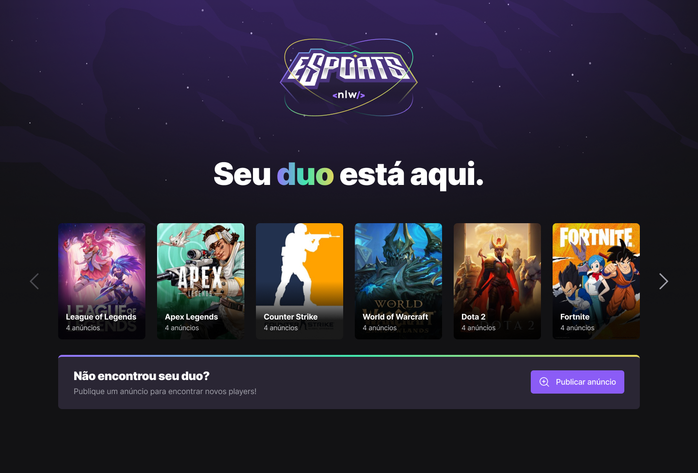
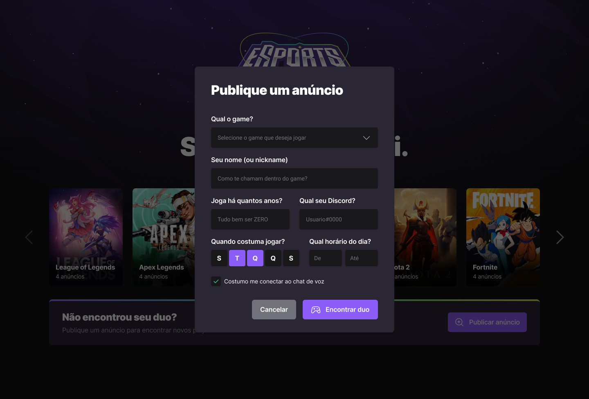
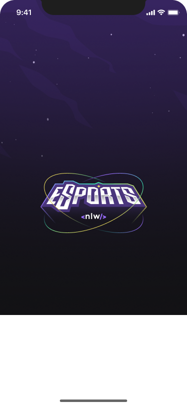
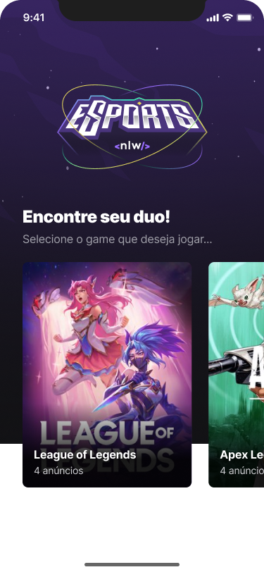
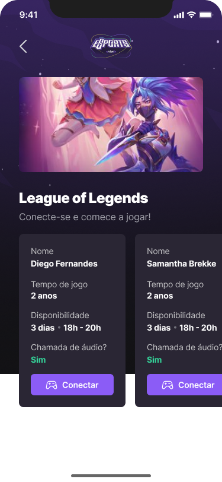
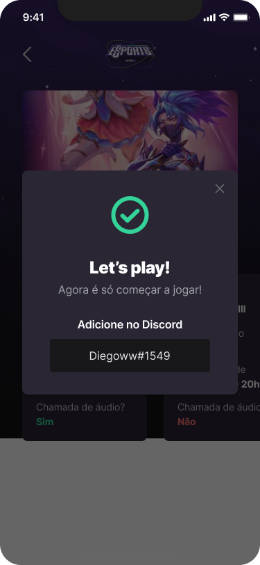

# Find your DUO

## ✉ About

A project made during the Next Level Week event, hosted by Rocketseat.
In this app, you can meet new people to play games with you.

## 🌆 Images




<div>
  
  
  
  
</div>

## 🎨 Figma

[Figma Design](https://www.figma.com/file/qcClcou5sV9RCydl3Nlfa8/NLW-eSports-(Community))

## ⚠ Requirements

In order to run the project, you will need:

- Node
- A web browser (Chrome, Firefox, Edge, etc...)

## 💻 Technologies Used

### FRONTEND

- Vite
- ReactJS
- Typescript
- TailwindCSS

### BACKEND

- Node.js
- Express
- Typescript
- Postgresql
- Prisma.io

### MOBILE

- React Native
- Expo

### EDITOR

- Visual Studio Code

## ⬇ How to download the project

```bash

git clone https://github.com/arthur-lage/nlw-esports.git

cd nlw-esports

# WEB

cd web 

npm install

npm run dev

# SERVER

cd server

npm install

npx prima migrate dev # Apply the database migrations

# Remember to setup your postgresql environment, add the variable "DATABASE_URL" to a .env file in the server folder with database name, username, password, etc.

npx run dev

# MOBILE 

npm install -g expo-cli

npm install

npx expo start

# Connect using your phone or mobile emulator

```

## 🔗 How to use the app

If you wish to test the application, click the link below:

[Find Your DUO - WEB](https://find-your-duo-al.vercel.com)